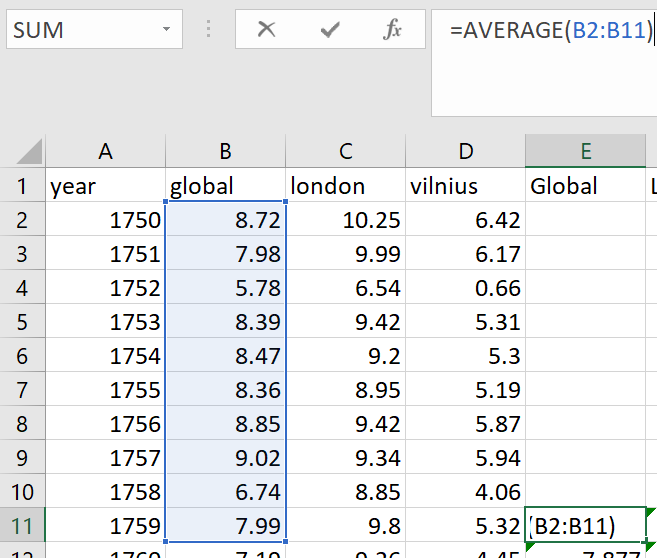
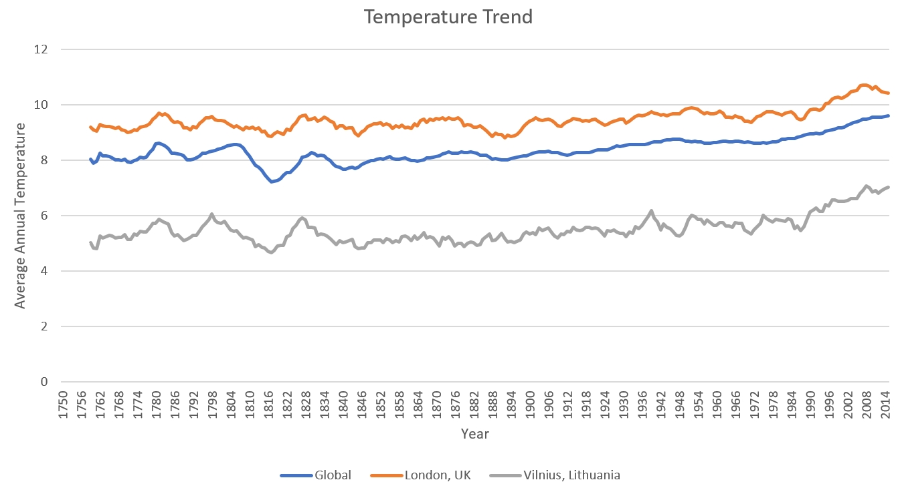

# Weather Trend Exploration
This is an exploration of global weather trend compared to two cities: London, UK and Vilnius, Lithuania. Data used - SQL database provided.

## Data Preparation

To choose cities I've selected cities from countries I recently lived in and chose closest cities.

```sql
select *
from city_list as cl
where cl.country in ('United Kingdom', 'Lithuania')
```

I've joined temperature data into one select to skip a step of copying and pasting columns from multiple spreadheets.

```sql
select
    glb.year,
    glb.avg_temp as global,
    lnd.avg_temp as london,
    vln.avg_temp as vilnius
from global_data as glb
left join city_data as lnd
    on lnd.year = glb.year
    and lnd.city = 'London'
    and lnd.country = 'United Kingdom'
left join city_data as vln
    on vln.year = glb.year
    and vln.city = 'Vilnius'
    and vln.country = 'Lithuania'
order by glb.year
```

I then downloaded the output of this query as CSV file and added moving average columns for all temperature trend columns. I chose 10 year moving average.



## Data Visualization

I used Excel to generate line chart from 10 year moving averages of global temperature along with local London and Vilnius temperatures.



## Observations

* Local London temperature tends to me higher compared to global average, while Vilnius tends to be lower;
* Local trends of both cities correlate with global trend;
* Global trend is less volatile than local ones;
* Overal trend shows that temperatures are gradualy rising.
